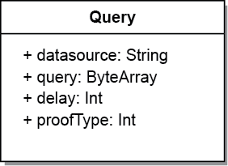
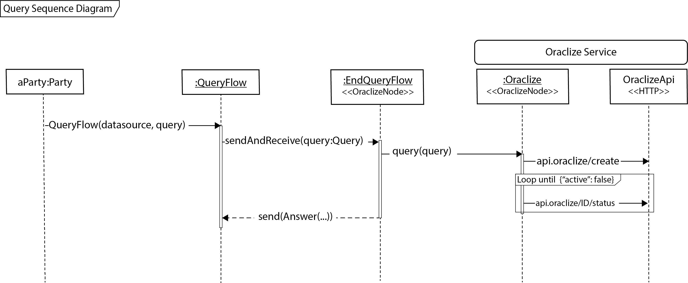
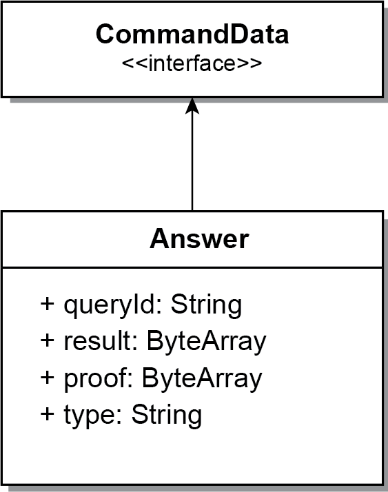
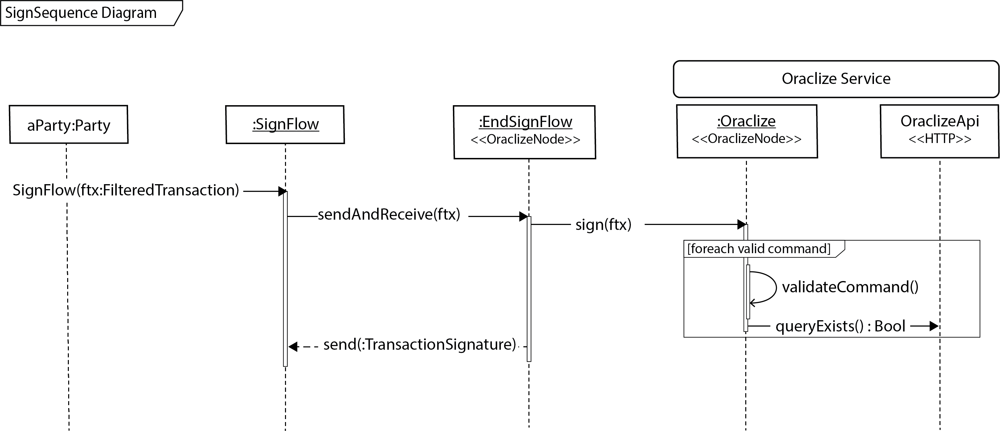

## Oraclize `corda-api` repo

Clone this repository with the `--recursive` flag, due the presence of submodules.

#### Examples

How to run the examples:

```bash
gradle deployNodes
./buid/nodes/runnodes
```

In the **`crash`** shell:

```bash
>>> start Example amount: 10
>>> run vaultQuery contractStateType: it.oraclize.cordapi.examples.states.CashOwningState
```

#### Add this to your cordapp

In the gradle put the following:

```groovy
repositories {
    maven { url 'https://jitpack.io' }
}

dependencies {
    compile "com.github.oraclize:corda-api:master-SNAPSHOT"
}
```


### Use case

We want to _issue_ cash to a _party_ only if an the change USD/GBP is above a certain value. A query asking for the USD/GBP rate to the Oraclize module will be performed.

The final transaction commited to the ledger will have:
 
  1. an _issue state_ which represents the fact of issuing some cash to a party
  2. an _issue command_ which wraps the issue state
  3. an _answer command_ which wraps the answer obtained by Oraclize

The transaction is depicted in the following figure:<br>


In this example, the following steps are performed:
  
1. A simply call to the `QueryFlow` provided by the Oraclize service is performed by the party interested in having the changing rate (in this example the party that calls `IssueCashFlow`):
  
```kotlin
  val answ = subFlow(
        Oraclize.QueryFlow("URL","json(http://api.fixer.io/latest?symbols=USD,GBP).rates.GBP")
    )
```

In the statement above, only the `datasource` and the `query` fields are given, but other fields like the `delay` and the `proofType` could be specified.
  
Therefore, the model of an Oraclize query is specified as follows:<br>


The tasks performed by the `QueryFlow` flow are depicted in the following diagram:<br>
<br>

Additionally, the `answ` variable is modeled by the following class:



which specifies the `json` containing the results and eventually the relative Oraclize _authenticity proof_.<br>
2. Once the answer has been received, an new `CashOwningState` is created and inserted in a issue command:
```kotlin
  val issueState = CashOwningState(amount, ourIdentity)
  val issueCommand = Command(CashIssueContract.Commands.Issue(),
                             issueState.participants.map { it.owningKey }
                     )
```
Also the answer is inserted in a command, in this way the contract can check verify the USD/GBP rate contained in the answer is below a prefixed thresh stored in the contract 
```kotlin
  val answerCommand = Command(answ, oracle.owningKey)
```
The `verify` function in the contract executes the following steps:
```kotlin
  override fun verify(tx: LedgerTransaction) {
            val issue = tx.commands.requireSingleCommand<Commands.Issue>()
            val answCmd = tx.commands.requireSingleCommand<Oraclize.Answer>()

            requireThat {
                val out = tx.outputsOfType<CashOwningState>().single()
                "No inputs should be consumed." using (tx.inputs.isEmpty())
                "Only one output should be produced." using (tx.outputs.size == 1)
                "All the participants must be signers" using
                        (issue.signers.containsAll((out.participants.map { it.owningKey })))

                val rate = answCmd.value.result as String
                "The rate USD/GBP must be over $USD_GBP_RATE_THRESH" using (rate.toDouble() > USD_GBP_RATE_THRESH)
            }
  }
```
3. A transaction is created by specifying the commands and the contract listed above
4. Once the transaction is verified, all the required signers must sign the transactiona and this is achieved by the following steps:
   - A filtered transaction is created, by filtering out all the non-`Answer` commands 
   ```kotlin
   fun filtering(elem: Any): Boolean {
                return when (elem) {
                    is Command<*> -> oracle.owningKey in elem.signers && 
                                     elem.value is Oraclize.Answer
                    else -> false
                }
            }
    val ftx = txBuilder.toWireTransaction(serviceHub).buildFilteredTransaction(Predicate { filtering(it) })
   ```
   - Then the `SignFlow` is automatically started once `CollectSignatureFlow` is called from the party

The signature process performed by the Oraclize service is presented in the following sequence diagram



5. Then the party interested signs the transaction as well adding the TransactionSignature containing the Oraclize signature
```kotlin
val fullySignedTx = serviceHub.signInitialTransaction(txBuilder)
                        .withAdditionalSignature(subFlow(Oraclize.SignFlow(ftx)))
```
6. We commit the transaction to the ledger by starting a  `FinalityFlow`
