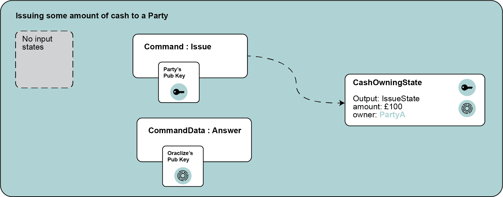

## Oraclize `corda-api`

### External references

Documentation: [docs.oraclize.it](http://docs.oraclize.it)

Gitter public support channel: 
[](https://gitter.im/oraclize/corda-api?utm_source=badge&utm_medium=badge&utm_campaign=pr-badge&utm_content=badge)


### Setup instructions

Clone this repository with the `--recursive` flag, due to the presence of submodules:

```bash
git clone --recursive https://github.com/oraclize/corda-api.git
git submodule update --init
```

Once cloned, go inside `libs/proof-verification-tool/` and build the tool:

```bash
yarn install
yarn build
yarn browserify-node
```

Then move the bundle into `resource` folder:

```
mv pvtBundle.js src/main/resources/proof-verification-tool
```

#### Build the project

```bash
gradlew build [-Pos=[macos, win32, linux]]
``` 

`-Pos` is optional and specify the architecture you want to build against to. This is useful if you want
to export the jar produced in a machine with a different operating system. 
If the `-Pos` argument is not given, the local architecture is automatically detected as well as the relative 
J2V8 dependency. 

#### Execute the example on TestNet:

Run `deployNodes` as in the previous paragraph and then load the generated `oraclize-corda-api-x.x.jar` into the 
plugins folder of your node on TestNet:

```bash
scp build/nodes/aNode/plugins/oraclize-corda-api-X.X.X.jar <host:port>:~/plugins/
```

Run the jar and type in the **`crash`** shell the following:

```bash
>>> start Example amount: 10
```

If you want to check the transaction stored, type:

```bash
>>> run vaultQuery contractStateType: it.oraclize.cordapi.examples.states.CashOwningState
```

#### Want to use Oraclize as a dependency?

Say no more, put the following lines into the `build.gradle` file:

```groovy
repositories {
    maven { url 'https://jitpack.io' }
}

dependencies {
    compile "com.github.oraclize:corda-api:master-SNAPSHOT"
}
```

### Use case

We want to _issue_ cash to a _party_ only if an the change USD/GBP is above a certain value. A query asking for the USD/GBP rate to the Oraclize module will be performed.

The final transaction commited to the ledger will have:
  
  1. an _issue state_ which represents the fact of issuing some cash to a party
  2. an _issue command_ which wraps the issue state
  3. an _answer command_ which wraps the answer obtained by Oraclize
  
as described in the following picture:



The steps performed by the example are:

**Step 1:** The `OraclizeQueryFlow` is called along with the following parameters:
  
  * *datasource:* define the type of datasource from which we want to submit the query (i.e. WolframAlpha, URL, Random, IPFS, computation, etc.);
  * *query:* is an array of parameters which needs to evaluated in order to complete a specific data source type request
  * *delay:* elapsed seconds before the query will be performed
  * *proof type:* a integer number that identifies the type of authenticity proof we want

```kotlin
val answ = subFlow(OraclizeQueryAwaitFlow(
        datasource = "URL",
        query = "json(https://min-api.cryptocompare.com/data/price?fsym=USD&tsyms=GBP).GBP",
        proofType = 16,
        delay = 0)
    )
```

`answ` is an instance of the `Answer` class and it will contain the following fields:

  * *queryID* the query identification string
  * *result* as a string or a byte array returned by the datasource
  * *proof* as a byte array
  * *type* of the result, defines the type of result given, `"str"` for `string`, `"hex"` for byte array

**Note:** `json(...)` is a parser implemented by our service to navigate in the json returned by the data source specified. For other parsers check [here](https://docs.oraclize.it/#general-concepts-parsing-helpers).

**Optional step:** Verify the proof received:

```kotlin
val proofVerificationTool = OraclizeUtils.ProofVerificationTool()
proofVerificationTool.verifyProof(answer.proof as ByteArray)
```

**Step 2:** after the `CashOwningState` and the `Answer` are defined, each one is then inserted in a command:

```kotlin
// The command which defines the fact of issuing cash
val issueState = CashOwningState(amount, ourIdentity)

// The command wrapping our Oraclize's answer
val issueCommand = Command(
    CashIssueContract.Commands.Issue(),
    issueState.participants.map { it.owningKey }
)
// Get Oraclize's node
val oracle = serviceHub.identityService
    .wellKnownPartyFromX500Name(OraclizeUtils.getNodeName()) as Party
val answerCommand = Command(answ, oracle.owningKey)
```

**Step 3:** The transaction is built and verified:

```kotlin
val txBuilder = TransactionBuilder(notary).withItems(
        StateAndContract(issueState, CashIssueContract.TEST_CONTRACT_ID),
        issueCommand, answerCommand)

txBuilder.toLedgerTransaction(serviceHub).verify()
```

The `verify()` is defined as follows:

```kotlin
override fun verify(tx: LedgerTransaction) {
    val issue = tx.commands.requireSingleCommand<Commands.Issue>()
    val answCmd = tx.commands.requireSingleCommand<Answer>()

    requireThat {
        // If some of these statements fails, the transaction is not valid
        val out = tx.outputsOfType<CashOwningState>().single()
        "No inputs should be consumed." using (tx.inputs.isEmpty())
        "Only one output should be produced." using (tx.outputs.size == 1)
        "All the participants must be signers" using
            (issue.signers.containsAll((out.participants.map { it.owningKey })))

        // Here we verify the Oraclize's answer...
        val rate = answCmd.value.result as String
        "The rate USD/GBP must be over $USD_GBP_RATE_THRESH" using (rate.toDouble() > USD_GBP_RATE_THRESH)
        // ...and the relative authenticity proof
        "Oraclize's proof verification failed" using  (
            proofVerificationTool.verifyProof(answCmd.value.proof as ByteArray))
    }
}
```

**Step 4:** Filter the transaction, keeping only `Answer`s commands:

```kotlin
fun filtering(elem: Any): Boolean {
    return when (elem) {
        is Command<*> -> oracle.owningKey in elem.signers && elem.value is Answer
        else -> false
    }
}

val ftx = txBuilder.toWireTransaction(serviceHub).buildFilteredTransaction(Predicate { filtering(it) })
```

**Step 5:** Collect the signatures from the others:
```kotlin
val fullySignedTx = serviceHub.signInitialTransaction(txBuilder)
                    .withAdditionalSignature(subFlow(OraclizeSignFlow(ftx)))
```

**Step 6:** Finalize the transaction with eventually some notary checking:

```kotlin
return subFlow(FinalityFlow(fullySignedTx, FINALIZING_TX.childProgressTracker()))
```

Once notary validation has been succeeded the transaction is inserted in the ledger.
